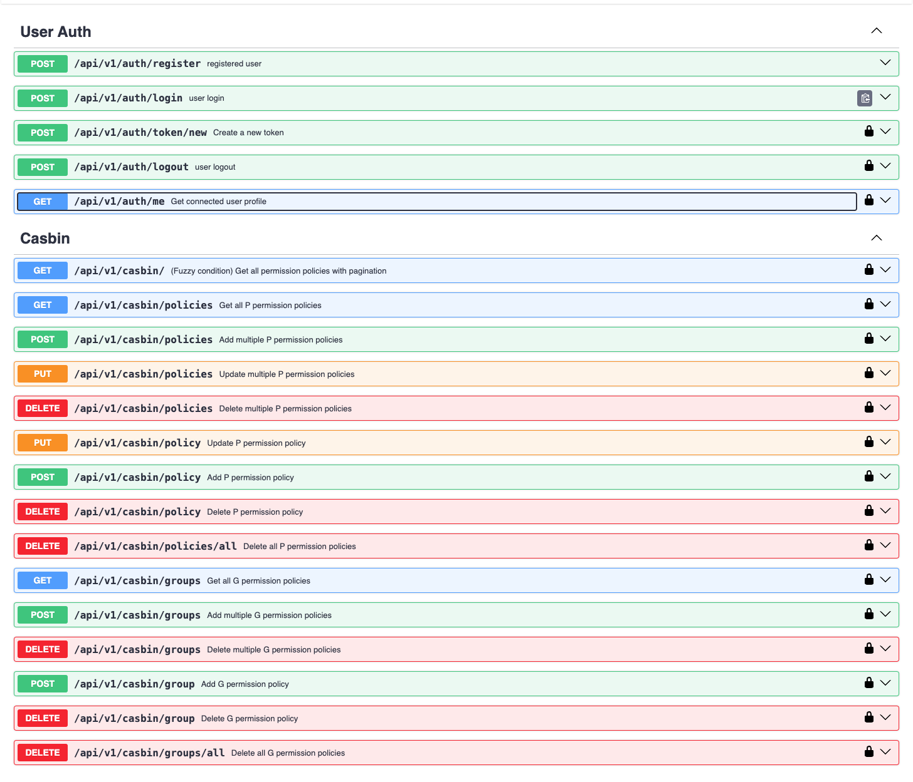

# FastAPI REST API boilerplate

## Description <!-- omit in toc -->

FastAPI REST API boilerplate is a comprehensive starting point for developing robust web applications. It provides a structured foundation equipped with essential features and configurations.



## Table of Contents <!-- omit in toc -->

- [Features](#features)
- [Project structure](#project-structure)
- [Environmnent variables](#environmnent-variables)
- [Quick run](#quick-run)
- [Comfortable development](#comfortable-development)
- [Links](#links)
- [x] Config Service ([Pydantic](https://docs.pydantic.dev/latest/concepts/pydantic_settings/)).
- [Database utils](#database-utils)
- [Tests in Docker](#tests-in-docker)
<!-- - [Tests](#tests)
- [Test benchmarking](#test-benchmarking) -->

## Features

- [x] Database ([Sqlalchemy](https://www.sqlalchemy.org)).
- [x] Database migration ([Alembic](https://alembic.sqlalchemy.org))
- [x] Swagger.
- [x] Redoc.
- [x] Sign in and sign up via email.
- [x] Social sign in (apple, facebook, google, linkedin, microsoft)
- [x] Seeding ([sqlalchemyseed](https://sqlalchemyseed.readthedocs.io/en/stable/)).
- [x] Login logs, operation logs, app logs.
- [x] Mailing
- [x] File uploads (aws s3, cloudinary, google cloud storage, minio)
- [x] Redis
- [x] Docker.
- [x] Admin and User roles using RBAC ([Casbin](https://casbin.org/fr/docs/rbac)).
- [x] Monitoring using grafana and prometheus ([Grafana](https://grafana.com/))
- [x] I18N
- [x] Versionning ([https://github.com/conventional-changelog/standard-version])
- [ ] Elasticseach (using [pgsync](https://pgsync.com/), [elasticsearch](https://www.elastic.co/guide/en/elasticsearch/reference/current/getting-started.html))
- [ ] Admin dashboard using ([sqladmin](https://aminalaee.dev/sqladmin/))
- [ ] E2E and units tests.
- [ ] Realtime notification using [messaging queue](https://www.rabbitmq.com/) and [python-socketio](https://python-socketio.readthedocs.io/en/latest/server.html)
- [ ] CI ([Gitlab](https://docs.gitlab.com/ee/ci/)).
- [ ] Precommit ([Pre-commit](https://pre-commit.com/))

## Project Structure

```
seeder           # Configurtion for database seeding
migrations       # Alembic migration files
app              # Rest api files
app.core         # General components like config, security, types, role, etc...
app.db           # Database connection specific
app.crud         # CRUD for types from models
app.models       # Sqlalchemy models
app.schemas      # Pydantic models that used in crud or handlers
app.templates    # Html files for mails
app.endpoints    # Restapi endpoints files
```

```
├── backend
|   |
│   ├── alembic
│   ├── core
│   ├── common
│   ├── app
│   │   ├── admin
│   │   | 
│   │   └── api.py
│   ├── crud
│   ├── database
│   ├── lang
|   ├── middleware
│   └── models
│   └── schemas
│   └── seeder
│   └── static
│   └── templates
│   └── utils
|
├── devops
├── etc
|── .vscode
|── .github
|──...

```

## Environmnent variables

To correctly run the project, you will need some environment variables. Expose & import them in core/config.py

`ENVIRONMENT`: Specifies the current runtime environment of the application. Possible values include dev, prod, and preprod.
`POSTGRES_HOST`: Hostname or address of the PostgreSQL database server.
`POSTGRES_PORT`: Port on which the PostgreSQL database server is listening (default is 5432).
`POSTGRES_USER`: Username used to authenticate with the PostgreSQL database.
`POSTGRES_PASSWORD`: Password for the PostgreSQL user.
`REDIS_HOST`: Hostname or address of the Redis server.
`REDIS_POR`: Port on which the Redis server is running (default is 6379).
`REDIS_PASSWOR`: Password for the Redis server. If blank, no authentication is required.
`REDIS_DATABAS`: Database index in Redis to use (default is 0).
`OTLP_GRPC_ENDPOIN`: gRPC endpoint for sending OpenTelemetry logs and traces, typically to Tempo or similar systems.
`TOKEN_SECRET_KE`: Secret key used for generating and verifying JWT tokens.
`OPERA_LOG_ENCRYPT_SECRET_KE`: Encryption key used to securely encrypt log data for operations.
`OAUTH2_GITHUB_CLIENT_I`: Client ID for GitHub OAuth2 integration.
`OAUTH2_GITHUB_CLIENT_SECRE`: Client secret for GitHub OAuth2 integration.
`OAUTH2_LINUX_DO_CLIENT_I`: Client ID for Linux DO OAuth2 integration.
`OAUTH2_LINUX_DO_CLIENT_SECRE`: Client secret for Linux DO OAuth2 integration.
`CELERY_BROKER_REDIS_DATABAS`: Redis database index for the Celery task broker.
`CELERY_BACKEND_REDIS_DATABAS`: Redis database index for Celery task results backend.
`RABBITMQ_HOS`: Hostname or address of the RabbitMQ message broker.
`RABBITMQ_POR`: Port on which RabbitMQ is running (default is 5672).
`RABBITMQ_USERNAM`: Username for authenticating with RabbitMQ.
`RABBITMQ_PASSWOR`: Password for the RabbitMQ user.
`MINIO_ENDPOIN`: Hostname or address for the MinIO server.
`MINIO_POR`: Port on which MinIO is running (default is 9000).
`MINIO_ACCESS_KE`: Access key for authenticating with the MinIO server.
`MINIO_SECRET_KE`: Secret key for authenticating with the MinIO server.
`MINIO_BUCKET_NAM`: Name of the MinIO bucket used for storing files.
`MINIO_CLOUD_UR`: Cloud URL for accessing MinIO content externally.
`SMTP_TL`: Boolean value indicating whether TLS is enabled for SMTP communication (True for enabled).
`SMTP_POR`: Port on which the SMTP server listens for connections (default is 587 for TLS).
`SMTP_HOS`: Hostname or address of the SMTP email server.
`SMTP_USE`: Username for authenticating with the SMTP server (typically an email address).
`EMAILS_FROM_EMAI`: Email address from which emails will be sent.
`EMAILS_FROM_NAM`: Display name associated with the sender's email address.
`SMTP_PASSWOR`: Password for the SMTP user account.
`GOOGLE_CLIENT_I`: Client ID for Google OAuth2 integration.
`GOOGLE_SECRET_KE`: Secret key for Google OAuth2 integration.
`GOOGLE_WEBHOOK_OAUTH_REDIRECT_UR`: Redirect URI used during Google OAuth2 authentication flow.
`GENAI_API_KE`: API key for accessing Generative AI services.


## Quick run

```bash
git clone --depth 1 https://github.com/kaanari-tech/fastapi-boilerplate.git my-app
cd my-app/devops/docker-compose
docker plugin install grafana/loki-docker-driver:2.9.2 --alias loki --grant-all-permissions
docker-compose up -d --build
```

For check status run

```bash
docker-compose logs
```

## Comfortable development

```bash
git clone --depth 1 https://github.com/kaanari-tech/fastapi-boilerplate.git my-app
cd my-app/
cp .env.example .env
```

Change `POSTGRES_HOST=boilerplate_postgres` to `POSTGRES_HOST=localhost`,
`POSTGRES_PORT=5432` to `POSTGRES_PORT=6001`
`RABBITMQ_HOST=boilerplate_rabbitmq` to `RABBITMQ_HOST=localhost`
`REDIS_HOST=boilerplate_redis` to `REDIS_HOST=localhost`
make sure you have [poetry](https://python-poetry.org) install
Run additional container:

```bash
docker-compose up -d boilerplate_postgres boilerplateminio boilerplate_redis
poetry install
poe migrate
poe run
```

## Links

- Swagger: <http://localhost:8000/admin/api/v1/docs>
- Redoc: <http://localhost:8000/redoc>
- Grafana dashboard: <http://localhost:3000>

on Grafana `http://localhost:3000` login with admin:admin

## Database utils

Generate migration

```bash
poe makemigrations
```

Run migration

```bash
poe migrate
```

Revert migration

```bash
poe dwngrade
```

Drop all tables in database

```bash
poe drop-tables
```
